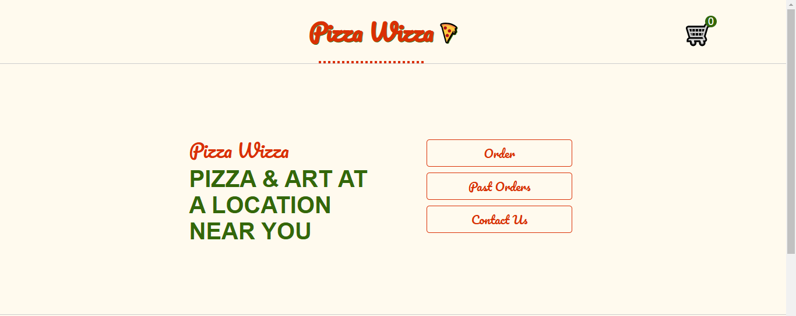

# Pizza-Wizza

**Pizza-Wizza** is a web application for ordering pizza, developed as part of a course project. This project showcases my learning journey and the technologies I have mastered.

## Demo

[Watch Video](https://drive.google.com/file/d/1daEkBV2CRxghPktV9lPcfcJNaAkxQfM-/view?usp=sharing)

## Technologies Used

- **JavaScript**: Primary language for the application logic.
- **React**: For building the user interface.
- **TanStack Router**: For managing routes within the application.
- **TanStack Query**: For handling server state management.
- **CSS**: For styling the application.
- **TypeScript**: For type safety in some parts of the application.
- **Testing Tools**: Utilized Vitest and Testing Library for testing components and hooks.

## Learning Outcomes

- **React**: Gained hands-on experience with functional components, hooks, and context API.
- **TanStack Router and Query**: Learned to set up and manage routes and handle server state effectively.
- **Testing**: Understood the importance of testing and practiced writing unit tests for components and hooks.
- **CSS**: Enhanced my skills in styling applications using modern CSS techniques.

## Project Status

Currently, the project is not fully deployed due to issues with API deployment. Efforts are ongoing to resolve these issues.
